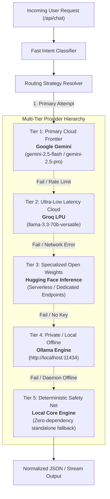

# Pihu-BreakThough - Stage 3 Design Document: Brain & AI Provider Router

> **Document Version**: 1.0.0  
> **Status**: Approved Architecture Specification  
> **Target Release**: Stage 3 (Brain & Multi-Provider Intelligent Routing)

---

## 1. Executive Summary & Vision

**Pihu-BreakThough** is engineered to be an adaptive, resilient, and multi-model AI assistant. Rather than binding the application tightly to a single proprietary LLM provider, Stage 3 introduces the **Pihu Brain Router**: an enterprise-grade routing and orchestration engine that dynamically routes queries across a multi-tier hierarchy of AI providers.

### Core Objectives:
1. **Zero Downtime via Multi-Tier Fallback**: Transparent cascading across providers (Gemini $\rightarrow$ Groq $\rightarrow$ Hugging Face $\rightarrow$ local Ollama $\rightarrow$ Deterministic Core) guarantees continuous availability.
2. **Intelligent Intent-Driven Routing**: Fast heuristic and semantic classification routes simple queries to ultra-low-latency engines, complex reasoning to frontier models, and private/offline queries to local hardware.
3. **Circuit Breaking & Fault Tolerance**: Failing or rate-limited endpoints are quarantined with automatic cooldown timers, preventing request hanging and cascading timeouts.
4. **Unified Abstraction Layer**: Standardized interfaces for single-turn generation, multi-turn conversations, and token streaming without provider leakage into application code.
5. **Privacy & Local-First Optionality**: Full native support for local Ollama instances when cloud API access is unavailable or disabled.

---

## 2. Multi-Tier Provider Hierarchy

The Brain Router organizes providers into five operational tiers:



### Provider Matrix

| Tier | Provider Identifier | Target Models | Primary Strengths | Fallback Trigger |
| :--- | :--- | :--- | :--- | :--- |
| **1** | `gemini` | `gemini-2.5-flash`, `gemini-2.5-pro` | High context window, multimodal, complex reasoning, structured JSON | Rate limits (HTTP 429), quota exhaustion, API key absent |
| **2** | `groq` | `llama-3.3-70b-versatile`, `mixtral-8x7b-32768` | Extreme inference speed (<300ms TTFT), conversational fluidity | Provider outage, context length overflow (>32k), API key absent |
| **3** | `huggingface` | `Qwen/Qwen2.5-72B-Instruct`, `meta-llama/Llama-3-70B` | Open-source ecosystem, task-specific checkpoints | Model loading cold-start (HTTP 503), rate limit |
| **4** | `ollama` | `llama3:latest`, `mistral`, `deepseek-r1` | 100% offline, absolute privacy, zero API bills | Local daemon not running, host out of memory |
| **5** | `stage1-deterministic` | `core-deterministic-v1` | 100% reliability, instant execution, zero external dependency | Guaranteed final safety net |

---

## 3. Intelligent Intent Classification & Routing Strategies

### 3.1 Intent Taxonomies

To route queries without introducing round-trip latency from an auxiliary LLM classifier, Pihu Brain utilizes a high-throughput, rule-based **Fast Intent Classifier**:

1. **`FAST_CHAT`**: Everyday conversational pleasantries, simple lookups, brief greetings.
   - *Target Provider*: Groq (sub-second TTFT) or Gemini Flash.
2. **`COMPLEX_REASONING`**: Multi-step logic, code architecture, mathematical proofs, long-form analysis.
   - *Target Provider*: Google Gemini 2.5 Pro / Flash.
3. **`CODING_SYSTEM`**: Script generation, bug fixing, SQL query formatting, technical documentation.
   - *Target Provider*: Gemini 2.5 Flash / Groq Llama 3.3.
4. **`LOCAL_PRIVATE`**: Requests explicitly marked private, or queries initiated when offline.
   - *Target Provider*: Local Ollama.
5. **`FALLBACK_SAFE`**: Unclassified or degraded system state.
   - *Target Provider*: Cascading chain down to Stage 1 deterministic engine.

### 3.2 Routing Strategies

The router supports distinct strategic modes selectable via request payload or system configuration:

- **`AUTO` (Default)**: Automatically pairs the detected `IntentType` with the optimal tier, falling back through lower tiers on failure.
- **`LOW_LATENCY`**: Always routes through Groq first; optimizes for immediate time-to-first-token.
- **`HIGH_QUALITY`**: Always routes through Gemini first; optimizes for depth, precision, and nuance.
- **`OFFLINE_ONLY`**: Restricts routing strictly to local Ollama and the deterministic safety net. No external outbound network requests are made.
- **`MANUAL`**: Explicit provider hint specified by the user (e.g. `"provider": "groq"`), preserving fallback safety if the requested provider is unavailable.

---

## 4. Fault Tolerance, Cooldowns & Circuit Breaking

To avoid hanging client requests on unresponsive APIs or burning quotas on throttled endpoints:

1. **Consecutive Failure Threshold**: If a provider fails 3 times consecutively (e.g., HTTP 429, 500, or socket timeout), its state shifts to `TRIPPED`.
2. **Cooldown Period**: Tripped providers enter a 60-second cooldown period during which they are skipped in routing chains.
3. **Half-Open Probe**: After the cooldown expires, the router sends a lightweight health probe or a single test traffic turn. If successful, the circuit resets to `HEALTHY`.
4. **Graceful Fallback Telemetry**: When a fallback occurs, the response metadata explicitly notes:
   ```json
   "metadata": {
     "requested_provider": "gemini",
     "active_provider": "groq",
     "fallback_occurred": true,
     "fallback_chain": ["gemini", "groq"],
     "latency_ms": 284
   }
   ```

---

## 5. Unified Provider Architecture & Abstraction Specification

The `pihu_core/providers.py` module defines the contracts that every provider must implement:

```python
class BaseProvider(ABC):
    @property
    @abstractmethod
    def name(self) -> str:
        """Unique provider identifier."""

    @property
    @abstractmethod
    def model_name(self) -> str:
        """Active model name."""

    @property
    @abstractmethod
    def capabilities(self) -> ProviderCapabilities:
        """Declared model capabilities (streaming, tools, max_context)."""

    @abstractmethod
    def is_available(self) -> bool:
        """Check presence of required credentials and network config."""

    @abstractmethod
    def health_check(self) -> bool:
        """Active health probe verifying endpoint responsiveness."""

    @abstractmethod
    def generate(
        self,
        message: str,
        history: Optional[List[Dict[str, str]]] = None,
        system_prompt: Optional[str] = None,
        **kwargs: Any
    ) -> ProviderResponse:
        """Synchronous chat generation."""

    @abstractmethod
    def stream_generate(
        self,
        message: str,
        history: Optional[List[Dict[str, str]]] = None,
        system_prompt: Optional[str] = None,
        **kwargs: Any
    ) -> Generator[StreamChunk, None, None]:
        """Streaming response generator."""
```

---

## 6. Implementation Phasing

- **Stage 1 (Complete)**: Application factory, clean API endpoints, deterministic core engine, zero external dependency boot.
- **Stage 2 (Complete)**: Neon PostgreSQL connection lifecycle, connection checking with `SELECT 1;`, and credential-safe error sanitization.
- **Stage 3 (Current)**: Brain architecture, unified provider abstractions, intent classification, multi-tier fallback router, circuit breaking, and mock testing.
- **Stage 4 (Upcoming)**: Database schemas, message persistence, session state management, live API client integrations (google-genai, groq-python), and SSE streaming endpoints.
